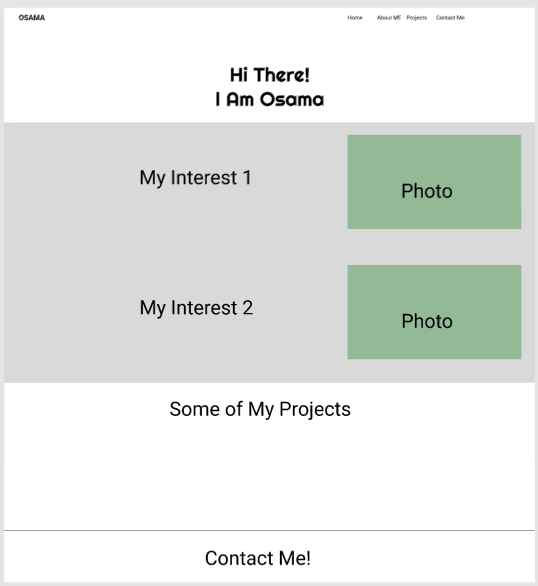
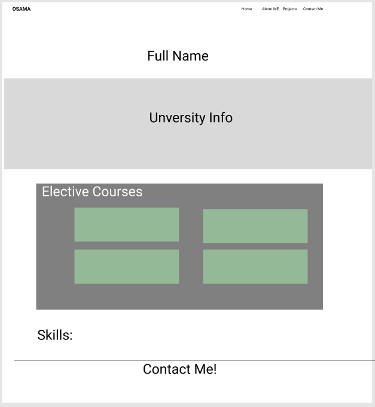
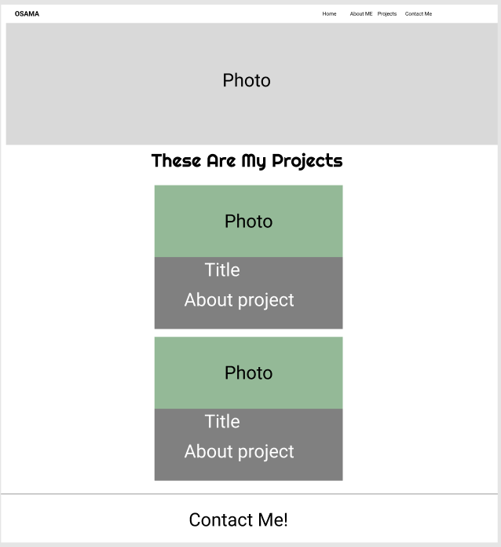
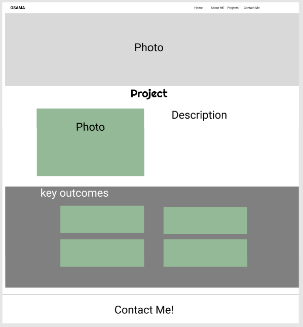
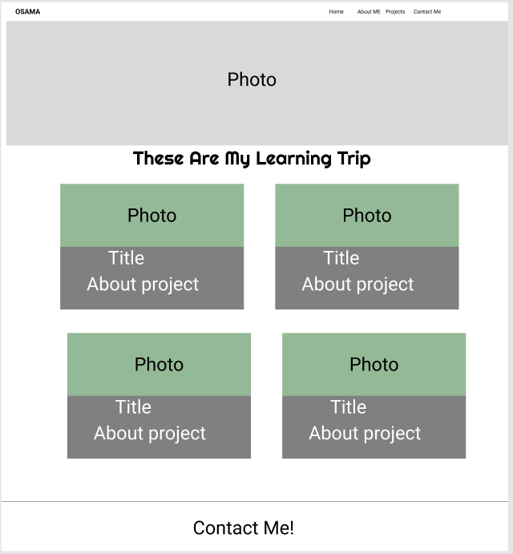
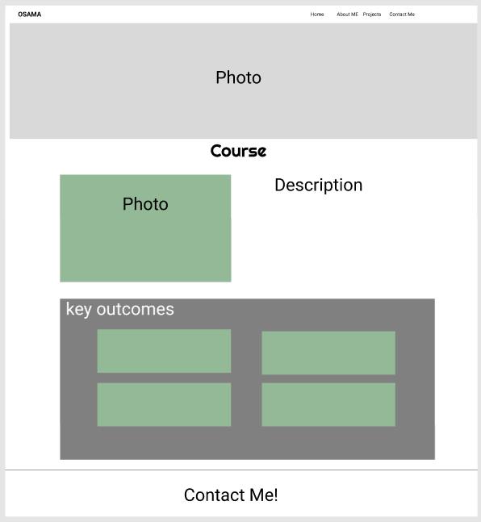
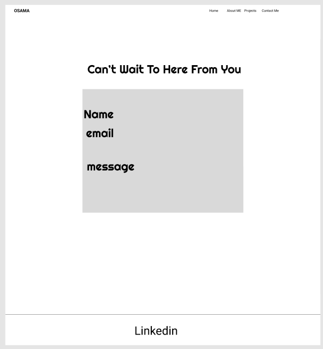

# UNIT-2-PROJECT

# UML Diagrams For Projects Models
## Project Model

## Course Model

## Interest Model

## Contact Model

# User Stories
## Home Page
### As a Visitor:
- I want to see a welcoming greeting ("Hi There! I Am Osama") so that I feel immediately engaged when I land on the homepage.
- I want to read a brief introduction about Osama, including his skills in web development, so that I can understand his expertise.
- I want to know that Osama works on both the front-end and back-end of websites.
- I want to see Osama's featuers project in quick look
- I want to have easy access to navigation options (Home, About Osama, Projects, Events, and Contact Osama) so that I can quickly find more information about Osama’s work and how to get in touch.
- I want to see a clear invitation to check out the events page, so I can easily find out about Courses Osama is involved in.
- I want to find contact options (like email and LinkedIn) clearly displayed, so I can easily reach out to Osama
- I want a straightforward message ("LET'S GET IN TOUCH"), so I feel encouraged to contact.

## About Me Page
### As a Visitor:
- I want to see the full name of osama.
- I want to know that Osama is a graduate of King Saud University, so I can understand his educational background.
-  I want to see the elective courses Osama took, so I can understand the areas of focus in his education.
-  I want to see a comprehensive list of Osama's programming skills.
-  I want to know Osama's proficiency in machine learning techniques.
-  I want to understand his familiarity with tools like Git and GitHub.

## Projects Page
### As a visitor:
- I want to easily identify the sectio to Osama's projects, so I can explore his work.
-  I want to see a well-organized projects section.
-  I want to see a clear overview of Osama's projects.
-  I want to learn about the types of projects Osama has worked on.
- I want to see the details of each project Osama worked on.

## Events Page
### As a visitor:
-  I want to see a clear overview of Osama's learning journey, so I can understand his background and achievements.
- I want to view the course certificates displayed on the learning page, so I can verify Osama's qualifications.

## Contact Me Page
### As a visitor:
- I want to easily find a way to contact Osama, so I can ask questions or provide feedback.

# Wireframes
## Home page:

## About Me Page:

## Projects Page:

## Projects Details page:

## Events Page:

## Events Details page:

## Contact Me page:

